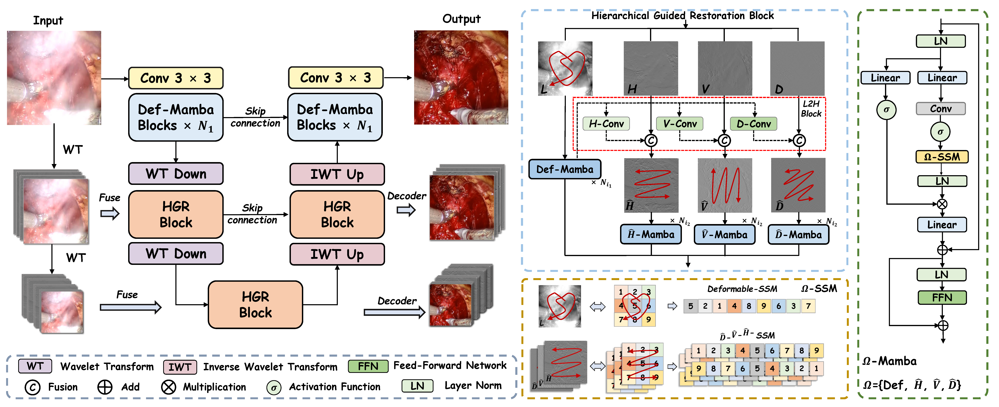

<h1 align="center">LoHi-Net</h1>

<p align="center">
  <strong>A Low-to-High Hierarchical Wavelet Network for Laparoscopic Surgical Smoke Removal</strong>
</p>

<p align="center">
  Shiwei Wu, Xiyuan Hu, Xiaobo Zhu, Dongyang Gao, Song Zhang, Hui Yan
</p>

<p align="center">
  <em>MICCAI 2026</em>
</p>

<p align="center">
  
  
  
  
</p>

---

## Overview

Surgical smoke generated during minimally invasive surgery severely degrades laparoscopic visibility and may increase operative risks. Existing smoke removal methods usually process smoke-degraded images holistically, overlooking the spectral differences between global smoke artifacts and local surgical textures.

We propose **LoHi-Net**, a **Low-to-High Hierarchical Wavelet Network** for laparoscopic surgical smoke removal. Based on wavelet decomposition, LoHi-Net first restores low-frequency structural components to suppress global smoke degradation, and then uses the restored low-frequency prior to guide high-frequency texture refinement.

## Highlights

- Wavelet analysis shows that surgical smoke mainly causes low-frequency global degradation, while fine texture errors remain in high-frequency components.
- LoHi-Net restores images in a low-to-high manner: low-frequency structure is recovered first and then used to guide high-frequency detail refinement.
- Frequency-specific Mamba variants are introduced for compact hierarchical modeling of different wavelet sub-bands.
- LoHi-Net achieves state-of-the-art performance on **VASST-desmoke** and **LSVD** with only **1.38M parameters** and **14.07G MACs**.

## Motivation

Wavelet-based frequency-domain analysis reveals that replacing the low-frequency component of a smoky image with that of a clear reference can largely remove global smoke, while the remaining reconstruction errors are concentrated in high-frequency details. This motivates the low-to-high hierarchical restoration design of LoHi-Net.

<p align="center">
  
</p>

## Framework

The overall framework of LoHi-Net is shown below.

<p align="center">
  
</p>

LoHi-Net uses wavelet transform and inverse wavelet transform as core operators for frequency decomposition and scale-aware downsampling/upsampling. Shallow layers employ Def-Mamba for spatial dependency modeling, while deeper layers use the proposed hierarchical wavelet restoration design.

## Visual Results

Qualitative comparison results on VASST-desmoke and LSVD:

<p align="center">
  
</p>

## Main Results

Quantitative comparison on the **VASST-desmoke** and **LSVD** datasets. Higher SSIM/PSNR is better, while lower CIEDE/Params/MACs is better.

| Method | VASST SSIM | VASST PSNR | VASST CIEDE | LSVD SSIM | LSVD PSNR | LSVD CIEDE | Params | MACs |
| --- | ---: | ---: | ---: | ---: | ---: | ---: | ---: | ---: |
| DehazeFormer-B | 0.886 | 26.599 | 4.195 | 0.796 | 26.340 | 4.330 | 2.52M | 19.76G |
| DEA-Net | 0.880 | 26.472 | 4.197 | 0.792 | 26.022 | 4.472 | 3.65M | 24.68G |
| ConvIR-S | 0.874 | 25.690 | 4.627 | 0.789 | 26.112 | 4.512 | 5.53M | 42.23G |
| SVP-Net | 0.854 | 25.051 | 5.027 | 0.755 | 25.186 | 4.919 | 17.46M | 152.67G |
| LGUTransformer | 0.880 | 26.329 | 4.347 | 0.792 | 26.305 | 4.285 | 5.54M | 32.45G |
| SGDN | 0.886 | 26.519 | 4.075 | 0.775 | 25.727 | 4.535 | 11.09M | 41.16G |
| WDMamba | 0.882 | 26.484 | 4.193 | 0.787 | 25.627 | 4.688 | 11.25M | 29.74G |
| **LoHi-Net** | **0.889** | **27.071** | **3.872** | **0.798** | **26.505** | **4.164** | **1.38M** | **14.07G** |

## Installation

Please follow the steps below to set up the environment.

- Python 3.10.16
- CUDA 11.8
- torch==2.0.1
- torchvision==0.15.2
- torchaudio==2.0.2

### 1. Clone the repository

```bash
git clone https://github.com/ShiweiWu98/LoHi-Net.git
cd LoHi-Net
```

### 2. Create a conda environment

```bash
conda create -n LoHi_Net python=3.10 -y
conda activate LoHi_Net
```

### 3. Install PyTorch with CUDA 11.8

```bash
pip install torch==2.0.1 torchvision==0.15.2 torchaudio==2.0.2 --index-url https://download.pytorch.org/whl/cu118
```

### 4. Install other dependencies

```bash
pip install --upgrade pip
pip install -r requirements.txt
pip install "mamba-ssm[causal-conv1d]==2.2.2" --no-build-isolation
```


For LSVD evaluation/training, the code uses the PWC-Net checkpoint at:

```bash
LSVD_models/pwcnet/pretrained_ckpt/pwcnet-network-default.pth
```

## Dataset Preparation

Please update dataset paths in the corresponding config files before training or testing:

- `configs/train_on_VASST/config.yaml`
- `configs/train_on_LSVD/config.yaml`

### VASST-desmoke

For VASST-desmoke style paired data, organize each split as:

```text
data/VASST_desmoke/
  train/
    smoky/
      0001.png
      0002.png
    smokeless/
      0001.png
      0002.png
  val/
    smoky/
    smokeless/
  test/
    smoky/
    smokeless/
```

Then set:

```yaml
data:
  params:
    train_root: /path/to/data/VASST_desmoke/train
    val_root: /path/to/data/VASST_desmoke/val
    test_root: /path/to/data/VASST_desmoke/test
```

### LSVD

The original LSVD dataset is already organized in the expected format, so no extra reorganization is required. Please keep the original video-clip folder structure. In each clip, the first frame is used as the clean reference frame, and the remaining frames are treated as smoke-degraded frames.

```text
data/LSVD_train/
  0001/
    0000.png
    0001.png
    0002.png
  0002/
    0000.png
    0001.png
data/LSVD_test/
  0001/
    0000.png
    0001.png
```

Then set:

```yaml
data:
  params:
    train_root: /path/to/data/LSVD_train
    val_root: /path/to/data/LSVD_test
    test_root: /path/to/data/LSVD_test
```

## Pretrained Models

We provide pretrained checkpoints under `ckpts/`.

```text
ckpts/
  train_on_VASST.ckpt
  train_on_LSVD.ckpt
```

## Training

Train on LSVD:

```bash
python main.py --config configs/train_on_LSVD/config.yaml
```

Train on VASST-desmoke:

```bash
python main.py --config configs/train_on_VASST/config.yaml
```

You can override common options from the command line:

```bash
python main.py \
  --config configs/train_on_LSVD/config.yaml \
  --devices 0 \
  --batch_size 3 \
  --max_epochs 350
```

Resume from a checkpoint:

```bash
python main.py --config configs/train_on_LSVD/config.yaml --resume /path/to/checkpoint.ckpt
```

## Testing and Inference

Testing and inference are both handled by `predict.py`. The script first runs Lightning `test()` and then saves restored images with `predict()`.

For LSVD:

```bash
python predict.py \
  --config configs/train_on_LSVD/config.yaml \
  --checkpoint ckpts/train_on_LSVD.ckpt \
  --predict_save_dir predictions/train_on_LSVD \
  --batch_size 1 \
  --devices 0
```

For VASST-desmoke:

```bash
python predict.py \
  --config configs/train_on_VASST/config.yaml \
  --checkpoint ckpts/train_on_VASST.ckpt \
  --predict_save_dir predictions/train_on_VASST \
  --batch_size 1 \
  --devices 0
```

The restored images are saved to `--predict_save_dir`.

## Demo

A small demo folder is included:

```text
demo/VSST_desmoke/
  smoky/
  smokeless/
  desmoked/
```

You can set `data.params.test_root` in `configs/train_on_VASST/config.yaml` to this demo path and run `predict.py` with `ckpts/train_on_VASST.ckpt`.

## Citation

The citation will be updated after the official proceedings version is available.

```bibtex
TODO
```
